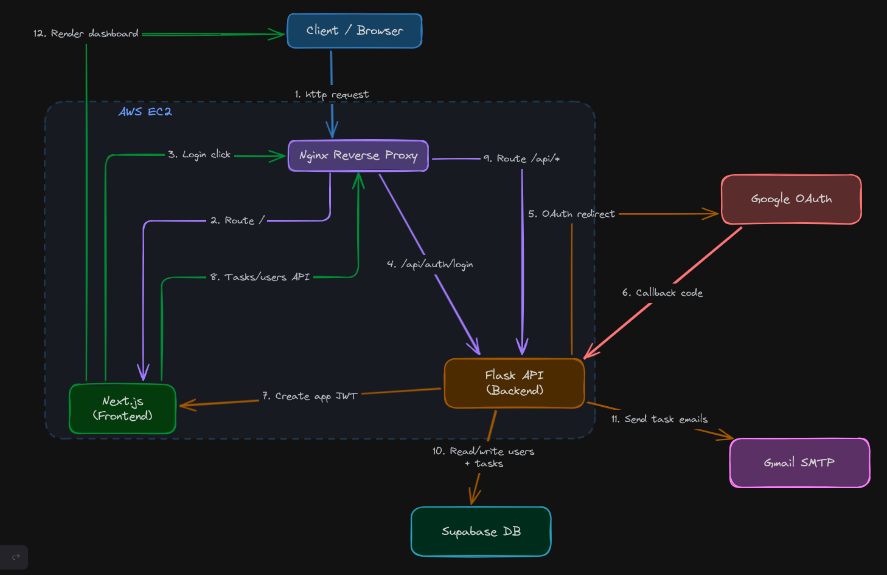
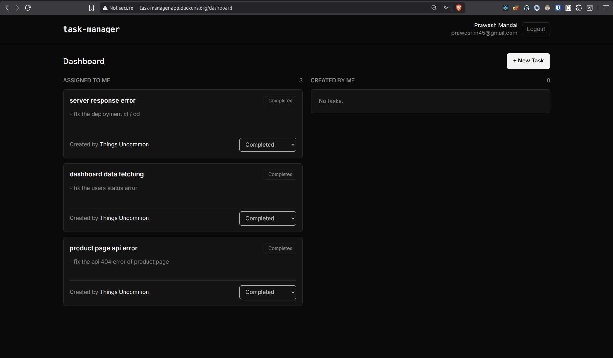
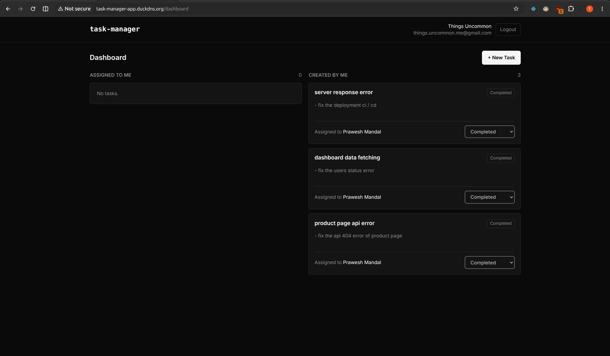
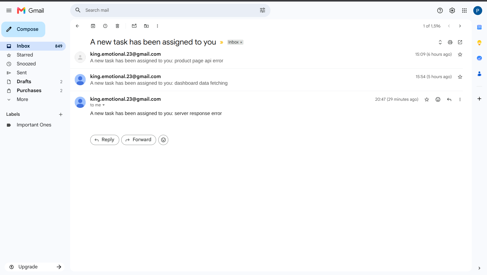
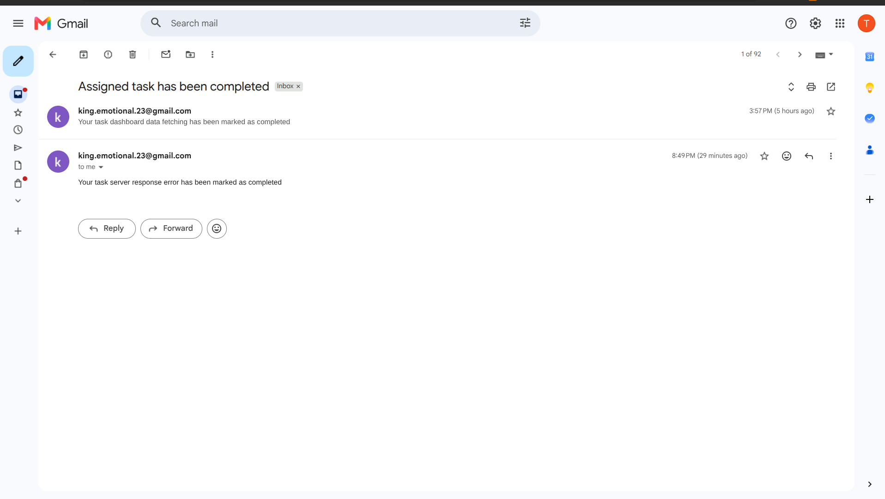

# Task Manager

Minimal task management app with Google login, Supabase storage and Gmail notifications.

---

## Features

- Login with Google
- Create tasks and assign them to other users
- View tasks assigned to you and tasks created by you
- Update status: pending, in progress, completed
- Confirmation before in-progress/completed updates
- Completed tasks are locked
- Email sent when a task is assigned or completed

---

## Architecture



---

## Previews

<table>
  <tr>
    <td></td>
    <td></td>
  </tr>
  <tr>
    <td></td>
    <td></td>
  </tr>
</table>

---

## Stack

- Frontend: Next.js, React, TypeScript, Tailwind CSS
- Backend: Flask
- Database: Supabase
- Auth: Google OAuth
- Email: Gmail app password
- Deployment: AWS EC2, Nginx, pm2
- CI/CD: Github Actions

---

## Project Structure

```text
backend/
  app.py                 Flask app setup
  auth.py                JWT auth helpers
  config.py              Environment config
  data/                  Supabase queries
  routes/                API endpoints
  services/              Google profile and email services

frontend/
  app/                   Next.js pages
  components/            UI components
  lib/                   API client, auth and types

migrations/              Supabase SQL schema
.github/workflows/      CI/CD workflows
ecosystem.config.js     PM2 process config
```

---

## Setup

Copy env file:

```bash
cp .env.example .env
```

Run the SQL files in Supabase:

```text
migrations/001_create_users.sql
migrations/002_create_tasks.sql
```

## Development

Install frontend dependencies:

```bash
npm --prefix frontend install
```

Start backend and frontend:

```bash
npm run dev
```

Frontend runs on:

```text
http://localhost:3000
```

Backend runs on:

```text
http://localhost:5000
```

## Build

```bash
npm run build
```

---

## Notes

- A user appears in the assign dropdown only after logging in once.

---
